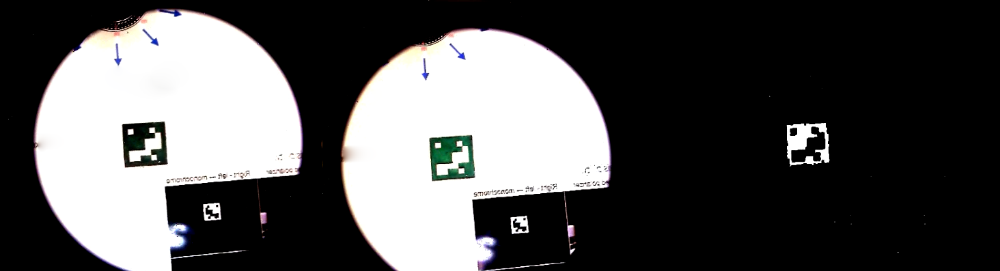

# CSR Detector - Algorithm

This library contains the approach to detect CSR-based materials in a two-camera setup hardware. The general methodology contains obtaining frames from two cameras and do some alignment and post-processings to filter everything but the part which is different will be highlighted.



Here is the pseudocode of the work:

```
PROGRAM CSRDetector:
  Read configurations;
  Read alignmentMatrix;
  FOREACH frame:
    Grab frames (R, G, B, or RGB);
    Convert to Grayscale;
    Register a frome to the other;
    Do a subtraction based on L2R or R2L;
    Do some post-processing to improve results;
  END FOREACH;
  RETURN outputs;
END.
```

## 📚 Required Libraries

Install the required libraries for running this program using the command below:

```
pip install numpy opencv-python
```

Please note that this repository is designed to work with [CSR Detector - Sensors](https://github.com/snt-arg/csr_sensors) library, which takes the camera outputs and use it to detect the CSR-based objects.

### Installation

Finally, install the package using `pip install -e .` to install the packages.

## 📁 Files & Folders

The functions defined in `sensorIDS.py` file contain:

- `maxFeatures`: maximum number of features for matching two images.
- `goodMatchPercentage`: define a threshold percentage for matching two images.
- `circlularMaskCoverage`: define how much the coverage of the circular mask should be (for the old design).
- `threshold`: value of threshold for separating layers.
- `erosionKernel`: the size of the kernel for erosion.
- `gaussianKernel`: the size of the kernel for gaussian blur.
- `enableCircularMask`: disable or enable the circular mask.
- `allChannels`: use all RGB channels for detection of CSRs.
- `rChannel`: use only R channels for detection of CSRs.
- `gChannel`: use only G channels for detection of CSRs.
- `bChannel`: use only B channels for detection of CSRs.
- `threshbin`: set thresholding method to Binary.
- `threshots`: set thresholding method to Otsu.
- `threshboth`: set thresholding method to Binary+Otsu.
- `isMarkerLeftHanded`: set if the marker is left-handed.

## ⚙️ Sample Usage

Below you can find an example of how to use the `process.py` file:

```python
import cv2 as cv

def main():
    # Create the camera object
    capL, capR = cv.VideoCapture(0), cv.VideoCapture(1)

    while True:
        # Capture a frame
        retL, frameL = capL.read()
        retR, frameR = capR.read()

        # Define 
        params = { ... }

        # Process the frame...
        frame = processFrames(frameL, frameR, retL, retR, params)

        cv.imshow('frames', frame)

        # Waits for a keystroke
        cv.waitKey(0)

    # Close the camera and release resources
    capL.release()
    capR.release()
    destroyAllWindows()

# Run the program
main()
```