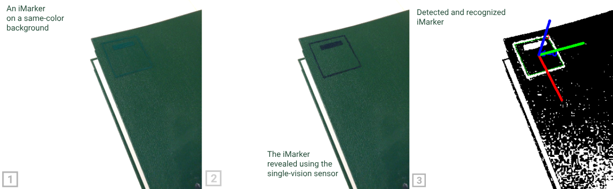

# iMarker Detector Algorithms



Welcome to the **iMarker Detector Algorithms** repository 🖥️!
This toolkit provides various `Python` implemented algorithms for detecting and revealing **CSR areas** for **iMarker** Detection.
It can receive visual sensor feed from [iMarker Detector Sensor Interfaces](https://github.com/snt-arg/iMarker_sensors).

## 🧠 About iMarkers

**iMarkers** are invisible fiducial markers detectable only by certain sensors and algorithms. They enable robust detection for human-robot interaction, AR applications, and indoor localization.
Read more about iMarkers (developed for the TRANSCEND project at the [University of Luxembourg](https://www.uni.lu/en/)) in [this link](https://snt-arg.github.io/iMarkers/).

## 🧰 Implemented Algorithms

Various hardware designs can be employed to detect **iMarkers** (and differentiate their CSR-coated regions). In general, these sensors are designed in two variants:

- **A. Dual-vision Sensor Setup:** a homogeneous perception system containing two (synchronized) cameras of the same type (_e.g.,_ two iDS cameras) fixed perpendicular to each other while facing different surfaces of an optical component, _i.e.,_ a beamsplitter.
  - _example_: dual-vision setups designed for [ELP](https://github.com/snt-arg/iMarker_sensors#usb-cam) and [iDS](https://github.com/snt-arg/iMarker_sensors#ids-cam) cameras.
- **B. Single-vision Sensor Setup:** a single camera with a polarizer (fixed or switching) attached to its lens.
  - _example_: single-vision setup using [RealSense](https://github.com/snt-arg/iMarker_sensors#rs-cam).

The algorithms in this repository contain the required functions for detecting iMarkers using both **Dual-vision** and **Single-vision Sensor Setups**.

## 🛠️ Getting Started

Clone the repository:

```bash
git clone git@github.com:snt-arg/iMarker_algorithms.git
cd iMarker_algorithms
```

(Optional) Create and activate a virtual environment:

```bash
python -m venv venv
source venv/bin/activate
```

```bash
pip install -r requirements.txt
# or setup.py by "pip install -e ."
```

This will install all the required dependencies, containing mainly `numpy>=1.24.4` and `opencv-python>=4.10.0.84`

## ⚒️ Algorithm Variations <a id="algorithms"></a>

Considering the setup chosen in [the detector sensors](https://github.com/snt-arg/iMarker_sensors), the algorithm to detect iMarkers (and CSR regions) may vary:

### 🔍 Algorithm 1: Dual-Vision iMarker Detection

**Inputs:** Frame-sets `F₁` and `F₂` from cameras `C₁` and `C₂`

**Output:** List of detected fiducial markers `M`

1. **Initialize:**

   - `M ← []`
   - `p₁ ← calibrate(C₁)`
   - `p₂ ← calibrate(C₂)`
   - `h ← align(F₁, F₂)` using `p₁` and `p₂`

2. **For each** frame `f₁` in `F₁`:

   - `f₂ ←` corresponding synchronized frame in `F₂`
   - `f₂ ← align(f₂)` based on `f₁` using `h`
   - `fₚ ← f₂ - f₁`  <!-- final subtracted image -->
   - `fₚ ← threshold(fₚ)`
   - `fₚ ← postprocess(fₚ)` _(erosion + Gaussian blur)_
   - **If** marker `m` is found in `fₚ`:
     - Append `m` to `M`

3. **Return** `M`

### 🔍 Algorithm 2: Static Single-Vision iMarker Detection (Masking)

**Input:** Frame-set `F` from the camera (RGB)  
**Output:** List of detected fiducial markers `M`

1. **Initialize:**

   - `M ← []`
   - `r ← (low, high)` ← _demanded color range in HSV_

2. **For each** frame `f` in `F`:

   - `fₚ ← convert(f)` to color space HSV
   - `fₚ ← filter(fₚ)` with the range `r`
   - `fₚ ← postprocess(fₚ)` _(erosion + Gaussian blur)_
   - **If** marker `m` is found in `fₚ`:
     - Append `m` to `M`

3. **Return** `M`

### 🔍 Algorithm 3: Dynamic Single-Vision iMarker Detection

**Input:** Frame-set `F` from the camera  
**Output:** List of detected fiducial markers `M`

1. **Initialize:**

   - `M ← []`
   - `f_prev ← null`

2. **For each** frame `f_t` in `F`:

   - `fₚ ← f_t - f_prev`  <!-- final subtracted image -->
   - `fₚ ← postprocess(fₚ)` _(erosion + Gaussian blur)_
   - `f_prev ← f_t`
   - **If** marker `m` is found in `fₚ`:
     - Append `m` to `M`

3. **Return** `M`

## 📑 Code Structure

It should be noted that this repository contains the functions to use the introduced algorithms as below:

- **A. Image Processing Algorithms:** in the `vision/` directory, you can find below functions:
  - `alignImages.py`: contains `alignImages` to align two given images (online) and `alignImagesWithMatrix` to align two images using a pre-defined homography matrix (offline)
  - `channelSeparator.py`: contains `channelSeparatorRGB` and `channelSeparatorHSV` functions to filter the input image based on a given channel in RGB and HSV, respectively.
  - `concatImages.py`: contains `frameResize` to resize an image and `imageConcatHorizontal` to concat a set of images for visualization.
  - `filterROI.py`: contains `applyCircularMask` to apply a filtration mask on a given image (for dual-vision ELP camera setup)
  - `postProcessing.py`: contains `postProcessing` function to improve the final processed image
- **B. Core Runner:** in `process.py`, you can find three main functions for each of the algorithms introduced in [the algorithm variations](https://github.com/snt-arg/csr_detector#algorithms) section:
  - `processStereoFrames`: for dual-vision setups
  - `processSingleFrame`: for the single-vision with fixed polarizer (camouflaged iMarker) setup
  - `processSequentialFrames`: for the single-vision with changable polarizer (using the function generator) setup

## 🚀 Running the Code

As mentioned before, the current repository is a sub-module and wrapped by [GUI-enabled standalone version](https://github.com/snt-arg/csr_detector_standalone) and [ROS-based version](https://github.com/snt-arg/csr_detector_ros) frameworks. Accordingly, take a look at the mentioned repositories to see examples of using iMarker detection algorithms.
